# 🎵 VibeCheck: AI Audio Analyzer & Remix Engine


> **A browser-based Digital Audio Workstation (DAW) component that uses Deep Learning to analyze musical mood and separate audio stems in real-time.**

---

## 📖 Overview

**VibeCheck** bridges the gap between passive audio listening and active creative interaction. It is a full-stack audio engineering platform that allows users to upload tracks, visualize waveform data, and perform complex AI inference tasks—specifically **Source Separation** (demixing songs) and **Context-Aware Mood Analysis**.

Unlike standard music players, VibeCheck runs a dedicated Python inference engine (`htdemucs_ft` model) to deconstruct audio into its raw components (Vocals, Drums, Bass, Other), enabling users to remix tracks instantly in the browser.

### ✨ Key Features

* **🎹 AI Remix Engine:** Deconstructs any MP3/WAV into 4 isolated stems using Meta's **Demucs Hybrid Transformer** model.
* **📊 Real-Time Visualization:** Interactive, high-performance waveform rendering using `wavesurfer.js`.
* **🧠 Vibe Analysis:** Extracts signal features (BPM, Spectral Centroid) via **Librosa** and generates mood descriptions using GenAI.
* **🐳 Containerized Inference:** Fully Dockerized backend ensures consistent execution of FFmpeg and PyTorch dependencies across environments.
* **⚡ Async Processing:** Non-blocking FastAPI architecture handles heavy compute tasks without freezing the UI.

---

## 🏗️ Architecture

VibeCheck uses a decoupled client-server architecture. The backend acts as a computational heavy-lifter, managing file I/O and GPU/CPU inference, while the frontend handles state and audio synchronization.

```mermaid
graph TD
    User[👤 User] -->|Uploads Audio| UI[⚛️ React Frontend]
    UI -->|POST /analyze| API[⚡ FastAPI Backend]
    UI -->|POST /remix| API
    
    subgraph "Backend Services"
        API -->|1. Decode| FFmpeg[🎞️ FFmpeg Wrapper]
        API -->|2. Signal Proc| Librosa[🐍 Librosa]
        API -->|3. Inference| Demucs[🧠 Demucs AI Model]
        
        Librosa -->|BPM/Spectrogram| JSON[📊 JSON Response]
        Demucs -->|Splits Audio| Stems[📂 File Storage]
    end
    
    JSON -->|Data| UI
    Stems -->|Serve Static WAVs| UI
```


## 🛠️ Tech Stack

| Component | Technology | Description |
| :--- | :--- | :--- |
| **Frontend** | React + Vite | Fast, component-based UI with Hot Module Replacement. |
| **Audio UI** | Wavesurfer.js | Canvas-based waveform rendering and audio synchronization. |
| **Backend** | FastAPI (Python) | High-performance async API for handling ML inference requests. |
| **AI Model** | Demucs (PyTorch) | SOTA music source separation model by Meta Research. |
| **DSP** | Librosa / FFmpeg | Digital Signal Processing for feature extraction and decoding. |
| **Infrastructure** | Docker | Containerization for reproducible builds (handling system-level dependencies). |

## 🚀 Getting Started
Prerequisites
* Node.js (v18+)
* Python (3.10+)
* FFmpeg (Installed and added to System PATH)
* Optional: Docker Desktop

### Option A: Quick Start (Local)
### 1. Clone the Repository
``` bash
git clone [https://github.com/yourusername/VibeCheck.git](https://github.com/yourusername/VibeCheck.git)
cd VibeCheck
```
### 2. Backend Setup
``` bash
cd backend
python -m venv venv
# Windows
.\venv\Scripts\activate
# Mac/Linux
source venv/bin/activate

# Install dependencies (Custom Demucs install required for Windows)
pip install --upgrade pip setuptools wheel
pip install torch torchaudio
pip install git+[https://github.com/facebookresearch/demucs#egg=demucs](https://github.com/facebookresearch/demucs#egg=demucs)
pip install -r requirements.txt

# Start Server
python main.py
```
### 3. Frontend Setup
``` bash
cd ../frontend
npm install
npm run dev
```
Visit http://localhost:5173 to start remixing!

## Option B: Docker (Recommended for Deployment)
If you want to avoid installing FFmpeg manually, run the entire stack in a container.
``` bash
# Build the image
docker build -t vibecheck-backend ./backend

# Run the container (Mapping port 8000)
docker run -p 8000:8000 vibecheck-backend
```

## 🧠 Engineering Challenges & Solutions
* Dependency Hell (Windows vs. Linux)
*Challenge:* The AI model (demucs) requires specific C++ compilers for MP3 encoding (lameenc), which often breaks on standard Windows environments. Solution: I implemented a custom "Hotfix" pattern in the source code to mock the encoder dependency, allowing the pipeline to gracefully fall back to WAV processing. I also containerized the environment using Docker to abstract OS-level discrepancies.

* Latency vs. UX
*Challenge:* Source separation is compute-intensive (taking 20-40s on CPU). Solution: The frontend uses an optimistic UI state ("Analyzing...") while the backend processes audio asynchronously. The files are served via a static mount (/tracks) rather than streaming raw bytes, allowing the browser to cache and seek through stems instantly once ready.

## 🔮 Future Roadmap
* GPU Acceleration: Add CUDA support for sub-5-second inference times.
* MIDI Conversion: Convert separated drum stems into MIDI patterns.
* Cloud Storage: Integrate AWS S3 for persistent stem storage.